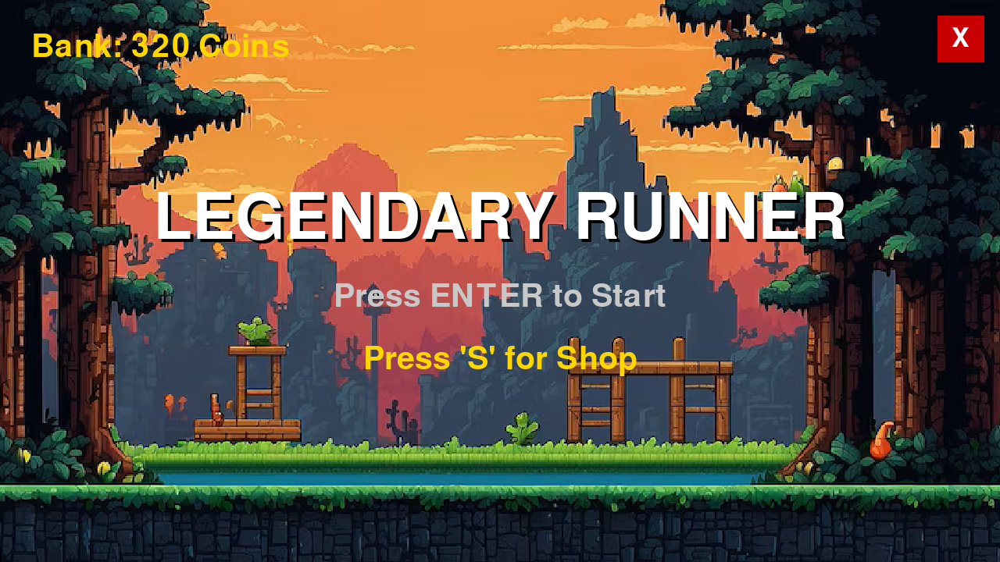
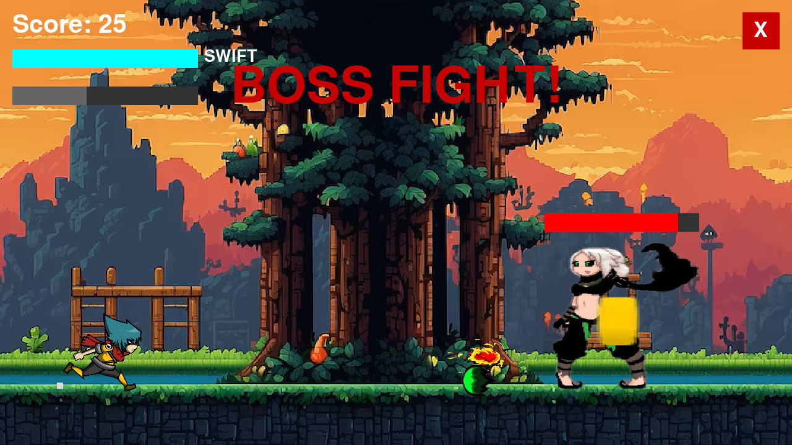
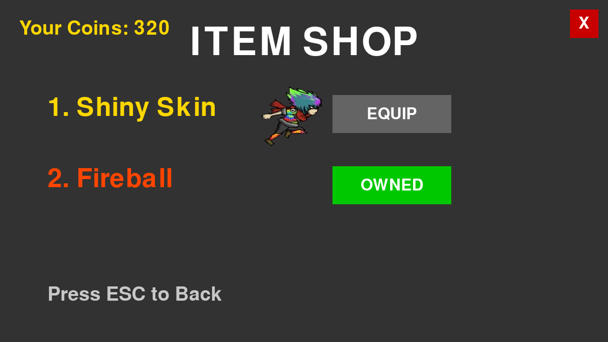
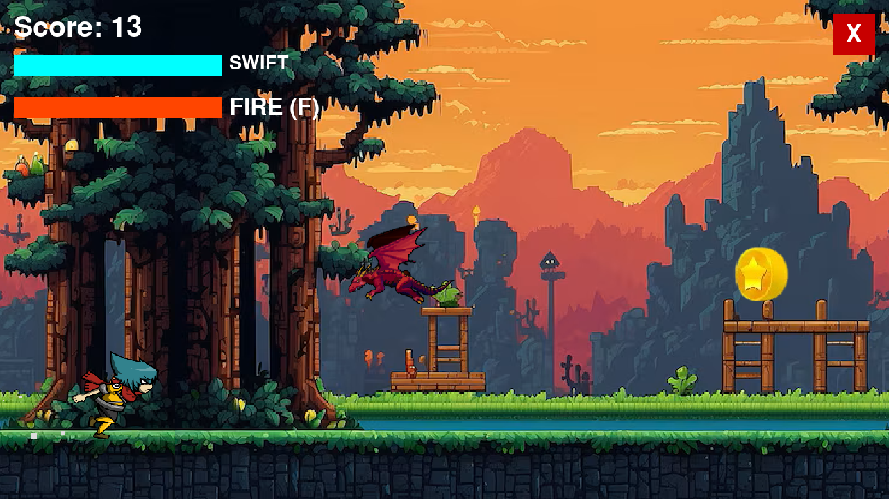
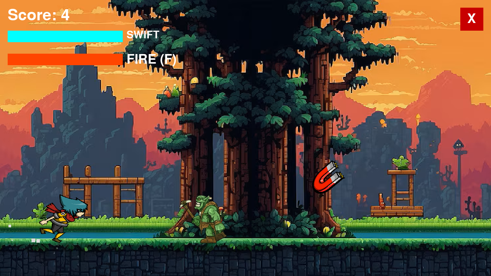

# 🏃‍♂️ Legendary Runner: Legendary Edition

> An action-packed endless runner game built with Python and Pygame, featuring animated boss fights, a shop system, and parallax backgrounds.



## 📸 Gameplay Gallery
| Boss Fight | Shop Menu | Gameplay 1 | Gameplay 2 |
| :---: | :---: | :---: | :---: |
|  |  |  |  |


## 🎮 Features
* **2 Unique Bosses:**
    * *The Flyer* (Aerial attacks with animated stingers)
    * *The Berserker* (Rapid-fire attacks)
* **Dynamic Combat:** Shoot fireballs and dodge projectiles.
* **Shop System:** Buy "Shiny Skin" and power-ups with collected coins.
* **Save System:** High scores and coins are saved automatically.

## 🛠️ Installation & Setup

1.  **Clone the repository:**
    ```bash
    git clone [https://github.com/Akshith1517/Legendary-Runner.git](https://github.com/Akshith1517/Legendary-Runner.git)
    ```
2.  **Install Dependencies:**
    You need Python installed. Then run:
    ```bash
    pip install pygame
    ```
3.  **Run the Game:**
    ```bash
    python main.py
    ```

## 🕹️ Controls
| Key | Action |
| :--- | :--- |
| **SPACE** | Jump |
| **LEFT SHIFT** | Swift (Dash) |
| **F** | Fire (Attack) |
| **S** | Open Shop (In Menu) |
| **ESC** | Pause / Back |

---
*Created by Akshith Chiniwal*